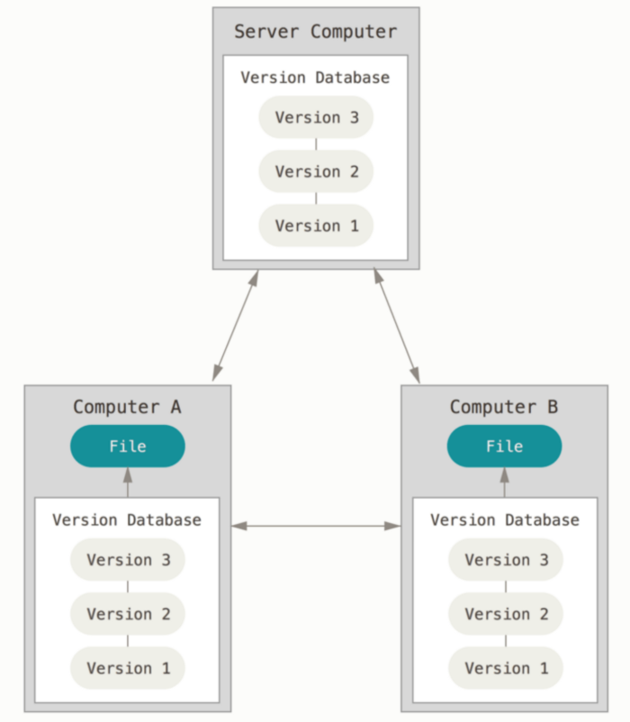
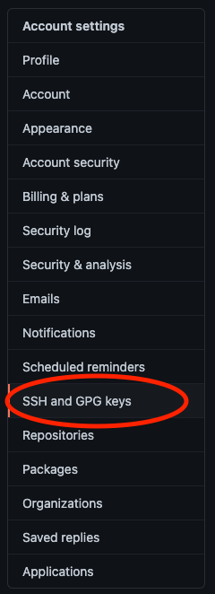
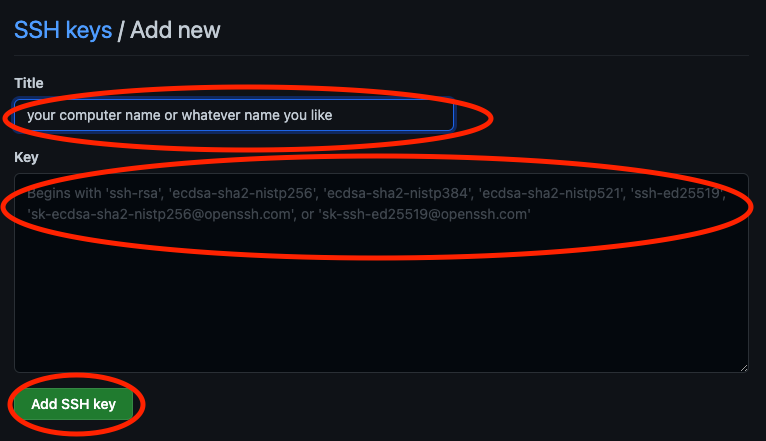
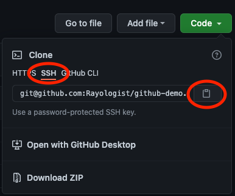
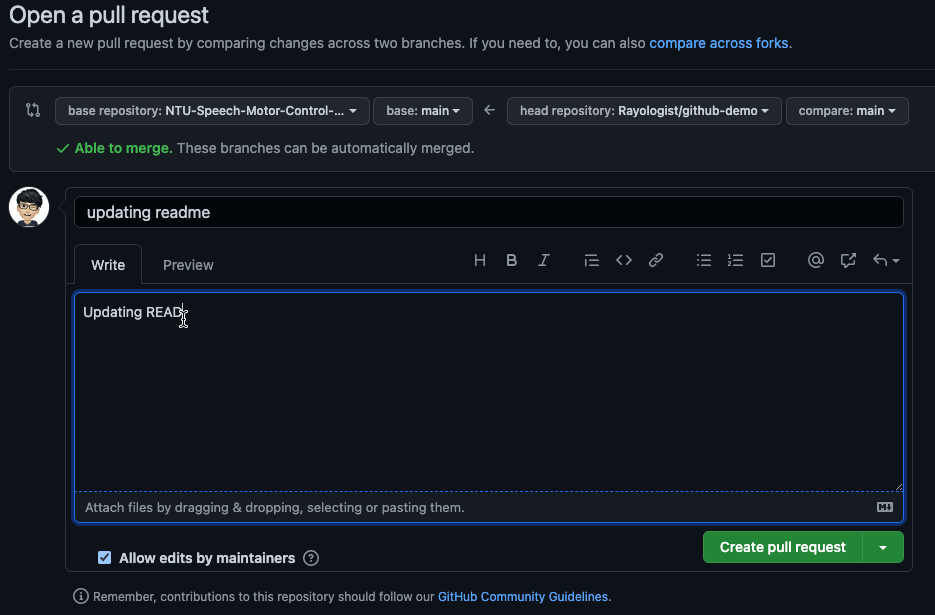

# Github Workflow Demonstration

- [Github Workflow Demostration](#github-workflow-demostration)
- [Why do we want to use Git?](#why-do-we-want-to-use-git)
- [What is Git?](#what-is-git)
- [Git vs. Github](#git-vs-github)
- [Git Commands vs. Github Desktop](#git-commands-vs-github-desktophttpsdesktopgithubcom)

- [1. Basic Shell Commands](#1-basic-shell-commands)
    - [1. **P**rint **W**orking **D**irectory](#1-print-working-directory)
    - [2. **C**hange **D**irectory](#2-change-directory)
    - [3. **M**a**k**e **Dir**ectroy](#3-make-directroy)
    - [4. **M**o**v**e or rename files](#4-move-or-rename-files)
    - [5. **L**i**s**t (files)](#5-list-files)
    - [6. Read Files](#6-read-files)
- [2. Symbols](#2-symbols)
- [3. Github Setup (SSH)](#3-github-setup-ssh)
- [4. Using Git Verbs](#4-using-git-verbs)
    - [1. Fork: make a copy from other's repository](#1-fork-make-a-copy-from-others-repository)
    - [2. Clone: download everything in a repository](#2-clone-download-everything-in-a-repository)
    - [3. Status: check Git status](#3-status-check-git-status)
    - [4. Log: check Git history](#4-log-check-git-history)
    - [5. Add: allow Git to track file changes](#5-add-allow-git-to-track-file-changes)
    - [6. Commit: submit a new version to Git](#6-commit-submit-a-new-version-to-git)
    - [7. Push: updating remote repository](#7-push-updating-remote-repository)
    - [**NEVER DO THIS Unless You Know What You Are Doing**](#never-do-this-unless-you-know-what-you-are-doing-)
    - [8. Pull: updating local repository](#8-pull-updating-local-repository)
- [5. Pull Request (PR)](#5-pull-request-pr)
- [6. Practice](#6-practice)
- [7. Resources](#7-resources)

# Why do we want to use Git?
The following pictures are from: [連猴子都能懂的Git入門指南](https://backlog.com/git-tutorial/tw/)

</br>
<div style="text-align:center;font-weight:bold;">


Problem 1: Chaotic Namings and Versions of Files

</br>


Problem 2: Conflicts When Collaborating on the Same Files

</br>


Git: Preserving File Versions and Raising Warnings When Modifying the Same Files

</div>

# What is Git?

### **Git is a distributed version control system**

<br>

The following pictures are from: [Manisha Basra](https://medium.com/swlh/things-about-git-and-github-you-need-to-know-as-developer-907baa0bed79)


### 1.

<div style="text-align:center;font-weight:bold;">



Distributed Version Control System

</div>


# Git vs. Github
From the [Stackoverflow](https://stackoverflow.com/questions/13321556/difference-between-git-and-github):

1. Git is a revision (or version) control system, a tool to manage your source code history.

2. GitHub is a hosting service for Git repositories.

3. So they are not the same thing: Git is the tool, GitHub is the service for projects that use Git.

</br>

# Git Commands vs. [Github Desktop](https://desktop.github.com)

### Both are able to do the same things, but using commands will be a lot faster than using Github Desktop.

</br>

# 1. Basic Shell Commands

### 1. **P**rint **W**orking **D**irectory
```bash
pwd
```

### 2. **C**hange **D**irectory
```bash
cd your/file/path/
```

###  3. **M**a**k**e **Dir**ectroy
```bash
mkdir your/folder/name
```

### 4. **M**o**v**e or rename files

```bash 
# move files
mv your/path/origin_name your/other/path/origin_name
```

```bash 
# rename files
mv origin_name modified_name
```

### 5. **L**i**s**t (files)
```bash
ls your/directory/
```

### 6. Read Files

```bash
# Print out all of your file contents
# cat: concatenate
cat <your file name>
cat <your first file name> <second> <etc>
```

```bash
# Print out your file contents one page at a time
less <your file name>

# press "q" to quit
# press "space bar" to output next page
```


# 2. Symbols
```bash
/ # root directory
~ # home directory
. # current directory
```


# 3. Github Setup (SSH)


### 1. Check if SSH public key exists
```bash
ls ~/.ssh
```
### 2. If **not**, type:
```bash
ssh-keygen
```

### 3. Copy your ssh key to Github
```bash
# For Mac
pbcopy < ~/.ssh/your.pub 
```

```powershell
# For Windows
clip < ~/.ssh/your.pub
```

1. Click your profile picture and find **Settings**.

    


2. Click **SSH and GPG keys** on the left hand side.

    


3. Click **New SSH Keys**

    

4. Click **Add SSH key** after filling out the form

    


# 4. Using Git Verbs


### 1. Fork: make a copy from other's repository


### 2. Clone: download everything in a repository



```bash
git clone <your copied url>
```

### 3. Status: check Git status

```bash
git status
```

### 4. Log: check Git history

```bash
git log
```

### 5. Add: allow Git to track file changes

```bash
git add your-file-name
```

```bash
git add .
```

### 6. Commit: submit a new version to Git

```bash
git commit -m "your commit message"
```

### 7. Push: updating remote repository

```bash
git push 
```

### <span style="color:red">**NEVER DO THIS Unless You Know What You Are Doing** </span>

```bash
# -f: force, will ignore any conflicts in the remote repository, wiping out your team members' hard work.

git push -f
```


### 8. Pull: updating local repository
```
git pull 
```

# 5. Pull Request (PR)

### 1. 


### 2. 


### 3.


### 4.



# 6. Practice

## Add your name and github account below.

* [Bo-wei Chen](https://github.com/Rayologist)


# 7. Resources

[W3HexShool](https://w3c.hexschool.com/git/fd426d5a) 

[連猴子都能懂的Git入門指南](https://backlog.com/git-tutorial/tw/)

